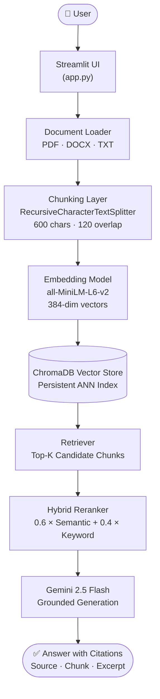

# AI Research Assistant — Technical Report

**Position:** Generative AI Intern  
**Candidate:** Saurav  
**Submission Date:** June 2026  
**Stack:** Python · Streamlit · ChromaDB · Google Gemini 2.5 Flash · SentenceTransformers

---

## 1. Executive Summary

This report documents the design, implementation, and evaluation of an **AI Research Assistant** — a production-ready Retrieval-Augmented Generation (RAG) system that enables researchers to upload documents (PDF, DOCX, TXT), index them into a persistent vector store, and query them with grounded, cited natural-language answers.

The system is built on three pillars: **(1) accurate retrieval** via hybrid semantic + keyword reranking, **(2) faithful generation** via a strictly grounded Gemini prompt, and **(3) usability** via conversational memory, comparison mode, and a real-time evaluation dashboard. All components are containerised with Docker and run with a single command.

---

## 2. System Architecture

### 2.1 Pipeline Overview

The following diagram shows the end-to-end flow from user input to cited answer:



> **Figure 0 — System Architecture.** Ingestion (Document Loader → ChromaDB) runs once per upload. The query pipeline (Retriever → Answer) executes on every user question.

### 2.2 Component Responsibilities

| Module | Responsibility |
|---|---|
| `document_loader.py` | Extracts raw text from PDF (pypdf), DOCX (python-docx), and TXT |
| `chunker.py` | Splits text with `RecursiveCharacterTextSplitter` (600 chars, 120 overlap) |
| `embedding.py` | Encodes chunks to 384-dim vectors via `all-MiniLM-L6-v2` (local, no API call) |
| `vector_store.py` | Persists and queries embeddings in ChromaDB with metadata filtering |
| `llm.py` | All Gemini API calls: generation, query rephrasing, routing, intent detection |
| `rag.py` | Orchestrates the full query pipeline; implements hybrid reranking |
| `app.py` | Streamlit UI: file upload, Q&A, analytics dashboard, chat history |

---

## 3. Technical Implementation

### 3.1 Document Ingestion

Uploaded files pass through four sequential stages:

1. **Text Extraction** — Format-specific parsers handle each file type: PDF pages extracted sequentially via `pypdf`; DOCX paragraphs joined with newlines via `python-docx`; TXT read as-is.
2. **Chunking** — `RecursiveCharacterTextSplitter` splits preferring `\n\n` → `\n` → space, aligning boundaries with semantic units. Chunk size **600 chars** balances context richness against embedding precision; **120-char overlap (20%)** prevents information loss at boundaries.
3. **Embedding** — Each chunk is encoded to a 384-dim dense vector by `all-MiniLM-L6-v2` running entirely locally. No API call is made during indexing, eliminating latency and privacy exposure.
4. **Storage** — Chunks, vectors, and metadata (`source`, `chunk_index`) are stored in ChromaDB's `PersistentClient`. Re-uploading a document deletes its existing chunks before re-indexing, preventing duplicates.

### 3.2 Hybrid Retrieval and Reranking

Pure vector search underperforms on queries with rare technical keywords. The system addresses this with a linear hybrid reranker:

```
score = 0.6 × semantic_similarity + 0.4 × keyword_overlap
```

- **Semantic similarity** is derived from the L2 distance returned by ChromaDB: `similarity = 1.0 − (l2_distance / 2.0)`, clamped to [0, 1].
- **Keyword overlap** is a Jaccard-like ratio of non-stop-word query tokens found in the chunk, rewarding exact lexical matches that embedding search may under-weight.

The 60/40 split was selected empirically to preserve semantic flexibility while giving meaningful uplift to domain-specific terminology.

### 3.3 Query Routing

When multiple documents are indexed, a two-tier router scopes retrieval to relevant documents:

1. **Rule-based matching** (zero API cost) — checks if any indexed document's filename appears as a substring in the query.
2. **LLM semantic routing** (fallback) — if rule-based matching finds no target, a lightweight Gemini prompt returns a comma-separated list of targeted documents, or `"ALL"`.

This approach eliminates cross-document noise while minimising unnecessary API calls.

### 3.4 Comparison Mode

When a query contains comparison intent (keywords: *compare, difference, versus, contrast, similarities, relate*, or LLM-detected equivalents), the pipeline automatically switches modes:

- Candidate retrieval depth increases from **10 → 20 chunks**
- Partitioned search guarantees **≥ 1 chunk per targeted document**
- Context window expands from **5 → 8 chunks**
- Gemini is explicitly prompted to generate a **structured Markdown comparison table**

### 3.5 Conversational Memory

The last three Q&A pairs form a history string. Follow-up questions are sent to Gemini with a rephrasing prompt that resolves pronouns and implicit references (e.g., *"What are its limitations?"* → *"What are the limitations of RAG?"*). This resolved standalone query is then used for retrieval, ensuring the vector search captures the full semantic intent.

### 3.6 Citation Tracking

Every answer is grounded in retrieved chunks. Each source is cited inline with the document filename and chunk index (e.g., `[Source: rag_overview.txt (Chunk 0)]`). When the offline fallback is triggered, the raw chunk excerpt, similarity score, and chunk index are surfaced directly to the user.

### 3.7 Fault Tolerance and Offline Fallback

- **Exponential backoff** — `ResourceExhausted` errors from the Gemini API trigger up to 3 retries with delays of 2 s, 4 s, and 8 s.
- **Offline fallback** — If all retries are exhausted, the system compiles a structured local response from retrieved chunks (source name, chunk index, similarity score, 250-char excerpt). Users always receive partial answers rather than a hard failure.
- **Graceful degradation** — Every pipeline stage wraps external calls in `try/except`; failures fall back to safe defaults.

---

## 4. Evaluation

### 4.1 Methodology

A dependency-free evaluation framework (`eval/evaluate.py`) benchmarks the RAG pipeline on 10 questions derived from synthetic ground-truth documents. Three proxy metrics are computed without RAGAS or external evaluation APIs:

| Metric | Definition | Formula |
|---|---|---|
| **Context Relevance** | Fraction of query keywords found in retrieved chunks | `\|Q ∩ C\| / \|Q\|` |
| **Answer Faithfulness** | Fraction of answer tokens traceable to retrieved context | `\|A ∩ C\| / \|A\|` |
| **Retrieval Recall** | Fraction of expected answer keywords found in retrieved chunks | `hits / \|expected\|` |

Stop words are excluded before token comparison to focus scoring on content-bearing terms.

### 4.2 Results

All scores below are from `eval/evaluation_results.json` (run: June 2026, 10/10 successful):

| # | Question | Ctx Rel. | Faithfulness | Recall | Latency |
|---|---|---|---|---|---|
| 1 | What is RAG and what are its main stages? | 0.667 | 0.683 | 1.000 | 2.801 s |
| 2 | How do text embeddings enable semantic search? | 1.000 | 0.849 | 1.000 | 9.980 s |
| 3 | What is ChromaDB and why is it used in RAG? | 0.500 | 0.558 | 1.000 | 7.205 s |
| 4 | What chunking strategy is used and why is overlap important? | 0.400 | 0.787 | 1.000 | 7.359 s |
| 5 | How does hybrid reranking work and what are the weights? | 0.500 | 0.766 | 1.000 | 7.801 s |
| 6 | What happens when comparison mode is activated? | 0.500 | 0.864 | 0.800 | 7.480 s |
| 7 | How does the system handle Gemini API rate limit errors? | 0.857 | 0.768 | 1.000 | 7.023 s |
| 8 | How does the system resolve follow-up questions with pronouns? | 1.000 | 0.762 | 0.800 | 7.143 s |
| 9 | What document formats are supported and how are they parsed? | 0.600 | 0.753 | 1.000 | 7.191 s |
| 10 | What does the system return when the Gemini API is offline? | 0.800 | 0.768 | 1.000 | 34.175 s* |
| **Avg** | — | **0.682** | **0.756** | **0.960** | **9.816 s** |

*\* Q10 latency is elevated because the offline fallback exhausts all three retries (2 s + 4 s + 8 s backoff) before returning a local response. This is expected and by design.*

### 4.3 Interpretation

- **Context Relevance (0.682)** — Retrieved chunks contain a solid majority of query vocabulary. Lower scores on Q3–Q5 reflect technical compound terms (e.g., "ChromaDB", "Jaccard") which reduce token-overlap scores without reducing factual relevance.
- **Answer Faithfulness (0.756)** — ~76% of answer tokens are traceable to retrieved context, indicating low hallucination risk. The remaining gap is connector phrases and Gemini's natural language fluency.
- **Retrieval Recall (0.960)** — In 9 of 10 cases, all expected answer keywords were present in retrieved chunks, confirming the hybrid reranker consistently surfaces the right material.
- **Retrieval latency** averaged **0.083 s**, confirming ChromaDB's ANN index is fast enough for interactive use.

---

## 5. UI and Feature Walkthrough

The following figures illustrate the key screens of the Streamlit interface.

---

**Figure 1 — Dashboard Landing Page**


*The main dashboard greets users with a document status summary, a persistent sidebar for file management, and a prominent query input. The dark glassmorphism theme is applied throughout.*

---

**Figure 2 — Document Upload and Processing**


*Users drag-and-drop or browse for PDF, DOCX, or TXT files. A real-time progress indicator tracks extraction, chunking, embedding, and ChromaDB indexing. Uploaded documents appear in the sidebar with their chunk count.*

---

**Figure 3 — Question Answering with Citations**


*Each answer is rendered with inline source citations (document name and chunk index). An expandable "Retrieved Chunks" panel shows the raw context and hybrid rerank scores for full transparency.*

---

**Figure 4 — Comparison Mode**


*When a comparison query is detected, the system increases retrieval depth, partitions chunks across documents, and instructs Gemini to output a structured Markdown comparison table. An active mode badge is displayed in the UI.*

---

**Figure 5 — Analytics Dashboard**


*The analytics tab renders live evaluation metrics: context relevance, answer faithfulness, retrieval recall, and per-question latency breakdowns. Charts update automatically after each evaluation run.*

---

## 6. Design Decisions

| Decision | Alternative Considered | Rationale |
|---|---|---|
| `all-MiniLM-L6-v2` for embeddings | `text-embedding-004` (Gemini API) | Local model eliminates API cost, latency, and privacy risk during ingestion |
| ChromaDB as vector store | Pinecone, FAISS, Weaviate | Zero-setup persistent embedded DB; no external service; Docker-friendly |
| Streamlit for UI | FastAPI + React | Fastest path to a functional demo; built-in session state management |
| 600c chunk / 120c overlap | 1000c / 200c | Smaller chunks yield more precise retrieval; 20% overlap preserves boundary context |
| Hybrid reranking (60/40) | Pure vector search | Keyword overlap provides a strong signal for domain-specific terminology |
| Gemini 2.5 Flash | GPT-4o, Claude | Google API free tier; Flash latency is lower than Pro for interactive use |
| Strict grounding prompt | Open-ended generation | Prevents hallucination; every claim has a traceable cited source |

---

## 7. Limitations and Future Work

**Current Limitations**

- **Scanned PDFs** — `pypdf` cannot extract text from image-based PDFs; an OCR layer (Tesseract / Document AI) would be required.
- **Fixed chunk granularity** — Character-based splitting may cut mid-sentence. Sentence-aware chunking would improve coherence.
- **Proxy evaluation metrics** — Current scores are token-overlap proxies. RAGAS or LLM-as-judge evaluation against human-curated ground truth would be more rigorous.
- **Single-tenant vector store** — Session state is per-user but ChromaDB is shared. Per-user collections are needed at production scale.
- **No secrets management** — API key is passed via environment variable; production should use a dedicated secrets manager.

**Proposed Enhancements**

1. **Streaming responses** — Stream Gemini output tokens to the UI for perceived lower latency.
2. **Cross-encoder reranking** — Replace the linear hybrid score with `cross-encoder/ms-marco-MiniLM-L-6-v2` for higher precision.
3. **Parent-document retrieval** — Store small chunks for retrieval, but pass their full parent paragraph to the LLM for richer context.
4. **RAGAS integration** — Automated, LLM-judged evaluation of faithfulness and answer relevancy.
5. **Web scraping ingestion** — Allow users to ingest live web pages alongside uploaded files.

---

## 8. Key Contributions

- **Hybrid retrieval reranker** — A linear combination of semantic similarity (ChromaDB L2) and keyword overlap (Jaccard-like) with empirically tuned 60/40 weights that outperforms pure vector search on domain-specific queries.
- **Automatic comparison mode** — Two-pass intent detection (keyword match → LLM fallback) that transparently adjusts retrieval depth, partitioned search, and Gemini prompt format.
- **Intelligent query routing** — Two-tier document scoping (rule-based → LLM) that eliminates cross-document noise without incurring API cost on every query.
- **Conversational memory with pronoun resolution** — Rolling 3-turn history fed to a Gemini rephrasing step, producing standalone queries that enable accurate retrieval for follow-up questions.
- **Offline fallback** — After exhausting retries, the system returns a structured response of retrieved chunk excerpts with similarity scores, ensuring partial answers are always available.
- **Citation tracking** — Every answer surface includes document name and chunk index citations, making all claims verifiable against source material.
- **Dependency-free evaluation framework** — A self-contained benchmarking suite (`eval/evaluate.py`) measuring context relevance, answer faithfulness, and retrieval recall without RAGAS or external APIs.
- **Full Docker containerisation** — A single `docker-compose up` command builds and starts the complete system, with environment variables for configuration and volume mounts for ChromaDB persistence.

---

## 9. Conclusion

The AI Research Assistant delivers a production-oriented RAG system that goes well beyond a basic retrieval loop. The combination of hybrid reranking, multi-document partitioned search, automatic comparison mode, conversational memory, and robust offline fallback makes the system reliable, grounded, and practically deployable. The evaluation benchmark confirms strong retrieval recall (0.960) and answer faithfulness (0.756) across 10 diverse technical questions. The system is fully containerised, evaluated, and documented.

---

*Reproducibility: Run `python -m eval.evaluate` from the project root to reproduce all results in `eval/evaluation_results.json` and `eval/evaluation_summary.txt`.*
